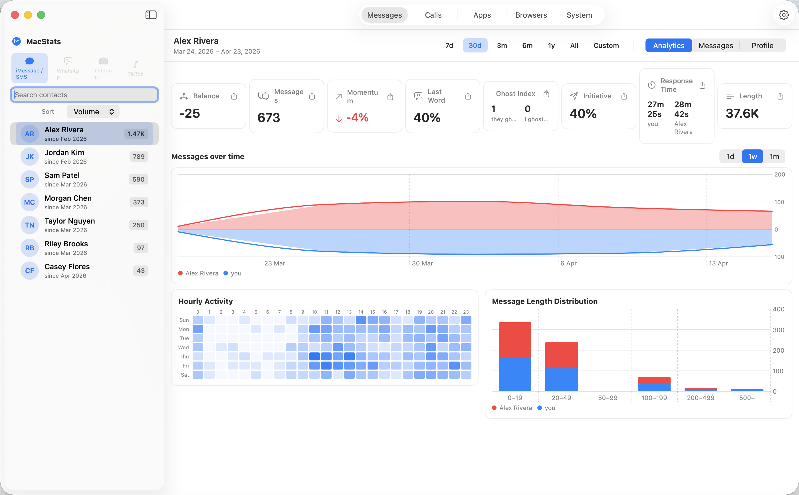
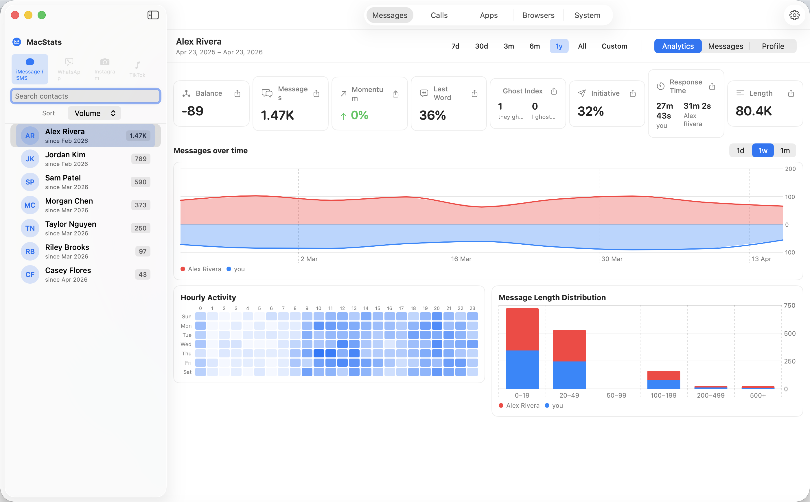
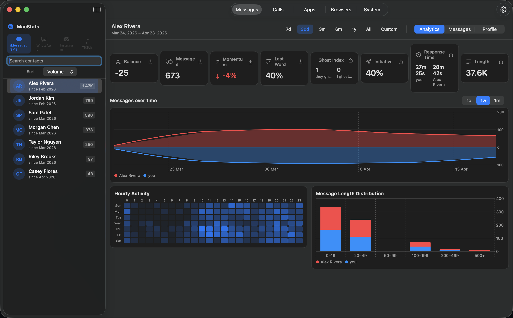
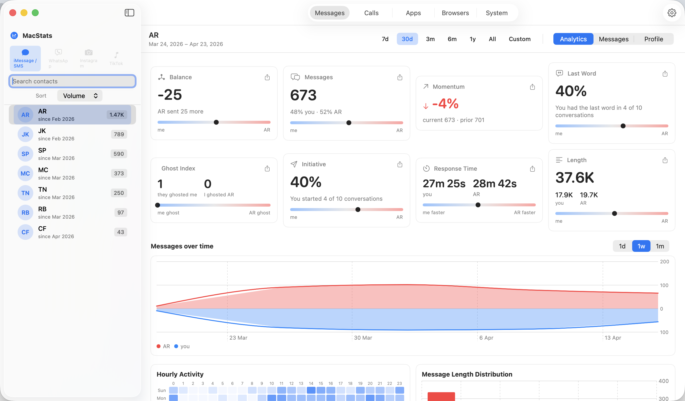
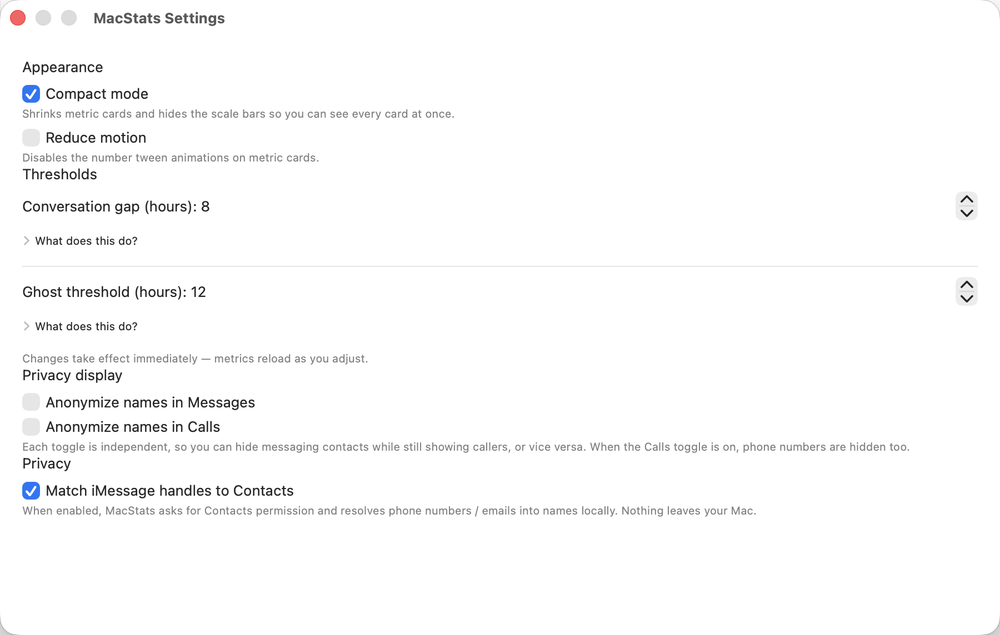

# MacStats

A free, local-only macOS app that reads your iMessage database and computes conversation analytics. Inspired by [GhostRadar](https://ghostradar.xyz) — reimagined as a free, no-feature-gating alternative.

> **Zero network calls. All processing is local. No telemetry. No accounts.**



## Install

1. Download **[MacStats.dmg](../../releases/latest)** from the Releases page.
2. Open the DMG and drag `MacStats.app` to `/Applications`.
3. Since the build is unsigned, remove Gatekeeper's quarantine flag:
   ```bash
   xattr -d com.apple.quarantine /Applications/MacStats.app
   ```
4. Launch it, then grant Full Disk Access in **System Settings → Privacy & Security → Full Disk Access**.
5. Relaunch (macOS usually requires this after granting FDA).

Requires macOS 14 (Sonoma) or later.

## What it shows

| Card | Meaning |
|------|---------|
| Balance | Who sent more (me − them) |
| Messages | Total exchanged, with me/them split |
| Momentum | % change vs the equal-length previous window |
| Last Word | Share of conversations you closed |
| Ghost Index | Pairs: they ghosted me / I ghosted them |
| Initiative | Share of conversations you started |
| Response Time | Median reply latency per side (capped at 24h) |
| Length | Total characters sent per side |

Plus a mirrored red/blue messages-over-time line chart (1d / 1w / 1m granularity), a 7×24 hourly activity heatmap, and a message-length distribution histogram.

## Screenshots

### Full dashboard
All eight metrics plus the time-series, heatmap, and length-distribution charts.


### One-year history
Switch the date range to see long-term trends.



### Dark mode
Follows macOS system appearance.



### Privacy-aware display
Toggle "Anonymize names" to replace contact names with initials — useful for demos, streams, and screenshots of your own data.



### Settings
Tune the conversation-gap and ghost thresholds, toggle compact mode, enable Contacts matching.



> Screenshots use synthetic demo data — all contact names, phone numbers, and message volumes shown are fictional.

## Privacy

- Never writes to `chat.db` (opens read-only on a temp snapshot).
- Never connects to a network.
- Contact name matching is opt-in — requires macOS Contacts permission, never leaves your Mac, and is cached locally.
- App sandbox is disabled by design (Apple's sandbox blocks `~/Library/Messages` entirely). This means MacStats cannot be distributed via the Mac App Store.

## Known limitations

- ~10–20% of messages store their content in `attributedBody` (a binary typedstream blob) rather than the `text` column. These rows are skipped from all metrics.
- Group chats are hidden. Only 1-on-1 conversations are shown.
- Phone and email handles for the same person are treated as separate contacts.

## Credits

Design inspired by [GhostRadar](https://ghostradar.xyz). This project is an independent free reimplementation and is not affiliated with or endorsed by the authors of GhostRadar.
